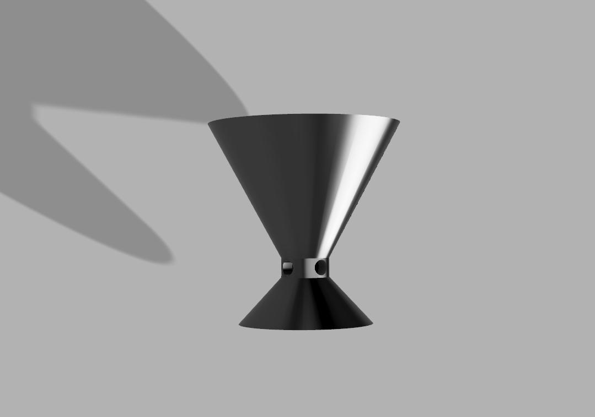
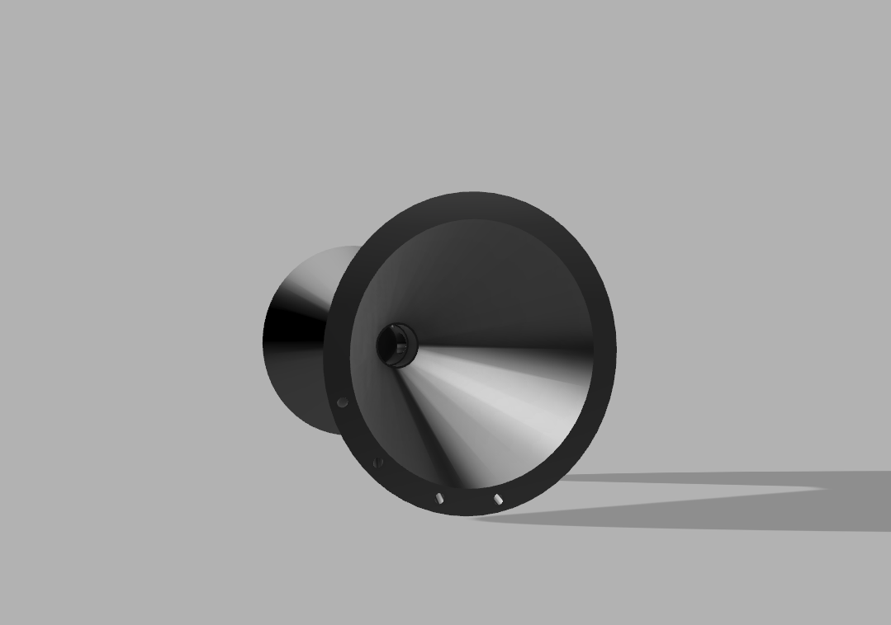
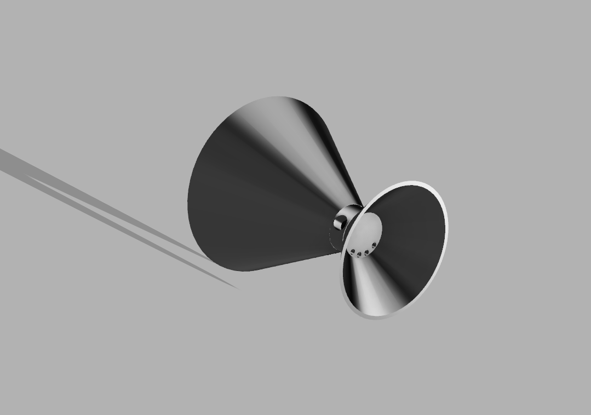
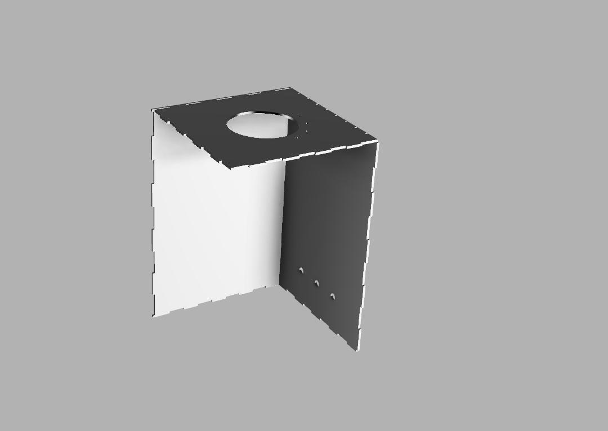
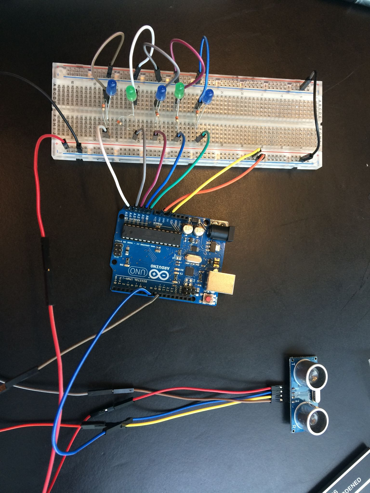
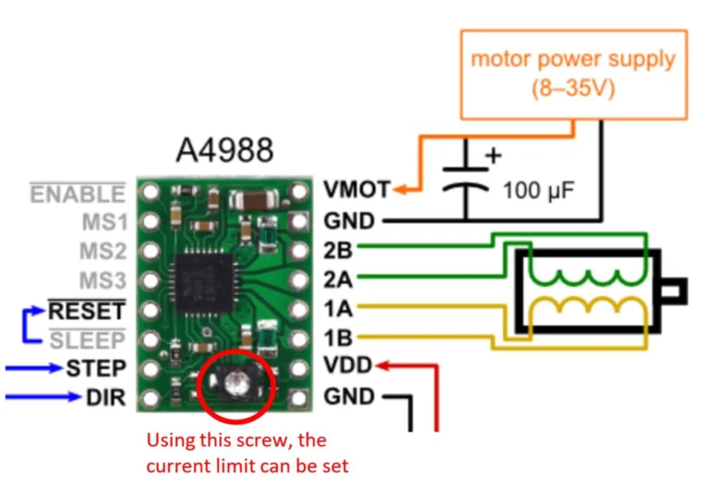

## HappyPlant: an Autonomous Irrigation System

The best way  to  cook  a  delicious  meal  is  byusing fresh herbs. Basil, parsley, cilantro, whatever  you  pick,  the  variations  of  green  leaves  willmake your kitchen and your dish always look muchmore appealing. That is, if you are able to keep thegreens  green.  And  that  is  where  we  fail  at.  Overand over we tried again to keep our herbs healthy.Because  how  hard  can  it  be  to  give  them  a  bit  ofwater  every  day?  The  evidence  of  a  sad  lookingplant  with  dried  out  brown  leaves,  shows  us  thatit  is  apparently  a  task  that  is  easily  forgotten.  Sowe  decided  we  needed  a  bit  of  help  of  moderntechnology to keep our plants green, growing, andhappy.

#### Requirements

When  designingHappyPlant,  the  project  grouphad  the  following  requirements  (both  functionaland non-functional).

• HappyPlant must  be  able  to  display  thewater level of the water tank using LEDs
• HappyPlant must  be  powered  through  a single PSU.
• HappyPlant must be able to water at least three plants.
• HappyPlant must  not  use  power  waste-fully.
• HappyPlant must   be   easy   to   use   (ina  “Plug’n’Play”-fashion).  It  should  requireonly plugging the sensors and water pipinginto  the  soil  of  the  plant  you  wish  to  keepgreen, and plugging the casings power sup-ply into the power outlet.
• HappyPlantshould  be  aesthetically  pleasing to look at. It should be the case that theowner  enjoys  his  ownership—both  becausehe/she does not need to water his/her plants on  his/her  own,  and  becauseHappyPlantprovides  a  futuristic  and  cool  look  to  theplant shelf.
• HappyPlantmust  be  affordable  by  every-body,   no   matter   their   income.   Therefore,the materials used to produce HappyPlant should be readily available and cheap to buy.

#### Design

The design contained a simple casing where a bottle would be hidden and funnel on the top to refill the bottle. The casing was designed in Fusion360 and 3D printed. We used stepper motors to pump out the water and used I2C soil moisture sensors to detect dryness of the soil.

Testing the waterlevel indicator:

Stepperdriver Schematic:

